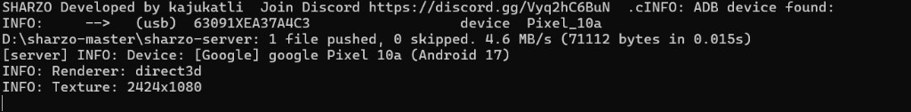
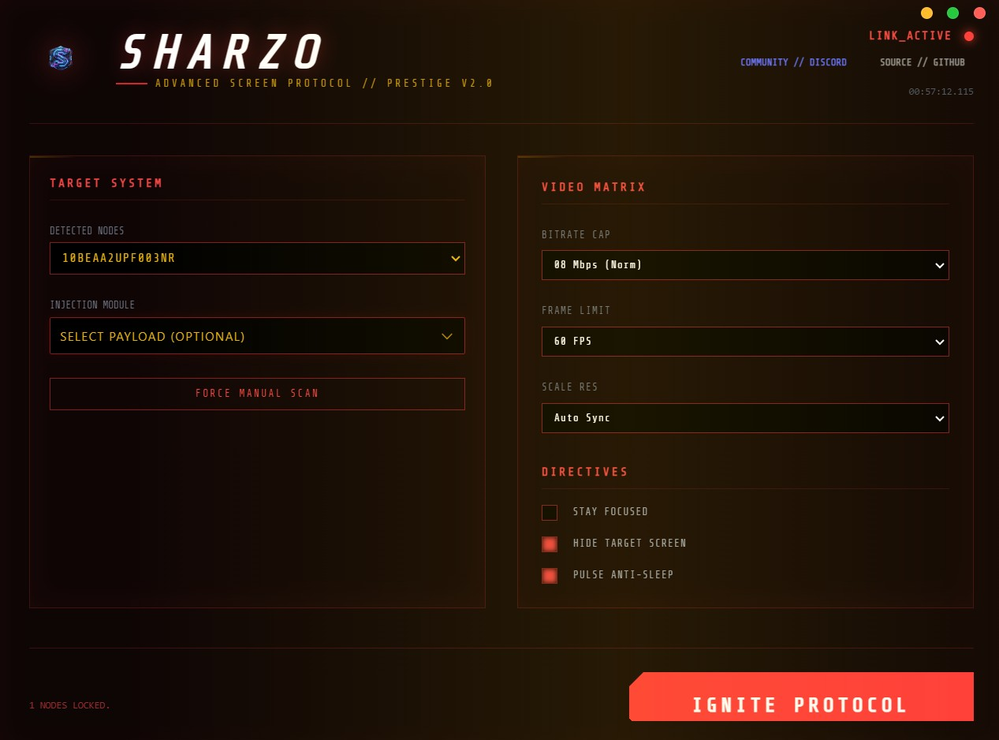

<div align="center">


# 🛸 SHARZO
### Precision Control & Elite Mirroring for Android

[](https://0xsharon.github.io/sharzo/)
[](LICENSE.md)
[](https://github.com/0xSHARON/sharzo)
[](https://discord.gg/Vyq2hC6BuN)

**Developed by KAJUKATLIii // Maintained by [0xSHARON](https://github.com/0xSHARON)**

> [!IMPORTANT]
> 🌐 **Live Website**: [https://0xsharon.github.io/sharzo/](https://0xsharon.github.io/sharzo/)
> 
> **FREE PREMIUM SUPPORT & THEMES**: Contact via Discord at **`kajukatli.`** or join [Our Community Discord](https://discord.gg/Vyq2hC6BuN).

---

| **SHARZO Normal (CLI Core)** | **SHARZO HUD (Cyberpunk GUI)** |
| :---: | :---: |
|  |  |

---

</div>

## 🌟 Overview

**SHARZO** is an ultra-low latency Android mirroring, audio forwarding, and remote-control workstation for Windows 10 & 11. Built for esports gamers, live streamers, content creators, and developers who demand zero bloat and sub-15ms latency.

SHARZO delivers two distinct execution modes:
1. **SHARZO Normal (CLI Core)** (`sharzo.exe`): Raw, zero-overhead standalone binary. Launches in milliseconds, consumes `< 15MB` RAM, and offers full command-line flag customization.
2. **SHARZO HUD (Cyberpunk GUI)** (`SHARZO HUD.exe`): Modern Electron-powered graphical HUD. Features automated ADB device scanning, one-click Android app launcher, resolution presets, and an always-on-top desktop widget mode.

---

## 📦 Installation & Setup

### Step 1: Download / Clone the Repository
Clone the repository using Git (or download the ZIP from GitHub):

```powershell
git clone https://github.com/0xSHARON/sharzo.git
cd sharzo
```

*All ADB drivers, FFmpeg video decoders, SDL2 multimedia engines, and the compiled HUD GUI are pre-bundled — no external driver installations required.*

---

### Step 2: Prepare Your Android Device

1. Open your Android phone's **Settings** > **About Phone**.
2. Locate **Build Number** and tap it **7 times** until you see the notification: *"You are now a developer!"*.
3. Go back to **Settings** > **System** (or **Additional Settings**) > **Developer Options**.
4. Enable **USB Debugging** (toggle switch to ON).
5. *(Optional for gaming)*: If available, enable **USB Debugging (Security Settings)** to allow full keyboard/mouse input injection.

---

### Step 3: Connect to PC

1. Plug your phone into your PC using a high-speed USB cable (USB 3.0 recommended).
2. Unlock your phone screen. A prompt will appear:
   > *"Allow USB debugging from this computer?"*
3. Check the box: ☑ **"Always allow from this computer"** and tap **Allow / OK**.
4. Verify connection by running in terminal:
   ```powershell
   .\adb.exe devices
   ```
   You should see your device ID with the status `device`.

---

## 🚀 How to Run SHARZO

You can run SHARZO using either the **Normal CLI** or the **HUD GUI**:

### Mode 1: Run SHARZO Normal (CLI) — *Fastest & Pure Performance*

* **Quick Launch**: Double-click **`sharzo.exe`** in the root folder.
* **Terminal Launch**: Run **`open_a_terminal_here.bat`** or open PowerShell in the project directory:
  ```powershell
  .\sharzo.exe
  ```
* **High Refresh Gaming (120 FPS / 1080p / 16Mbps)**:
  ```powershell
  .\sharzo.exe -m 1920 --max-fps 120 -b 16M
  ```
* **Mirror with Phone Screen Turned OFF** *(Saves battery & prevents overheating)*:
  ```powershell
  .\sharzo.exe --turn-screen-off --stay-awake
  ```
* **Record Device Directly to Video**:
  ```powershell
  .\sharzo.exe --record gameplay.mp4
  ```

---

### Mode 2: Run SHARZO HUD (Cyberpunk GUI) — *Visual Streamer Dashboard*

1. Open the project folder and navigate to:
   ```text
   gui\dist25\SHARZO HUD-win32-x64\
   ```
2. Double-click **`SHARZO HUD.exe`**.
3. **Using the HUD Dashboard**:
   * **Device Detection**: Connected ADB devices appear automatically in the dropdown list.
   * **App Launcher**: Scans third-party apps installed on your device. Select any game or app (e.g. Free Fire, PUBG, YouTube) and click to launch it directly on screen.
   * **Preset Controls**: Configure resolution, framerate, and toggles with intuitive sliders.
   * **Always-on-Top**: Toggle the pin icon to keep the HUD floating over your game or OBS streaming dashboard.
   * Click **LAUNCH PROTOCOL** to start the mirror stream!

---

## ⌨️ Keyboard Shortcuts & Hotkeys

All hotkeys use the **`Alt`** key by default as the modifier key (`MOD`):

| Hotkey | Action Description |
| :--- | :--- |
| <kbd>Alt</kbd> + <kbd>F</kbd> | Toggle Fullscreen mode |
| <kbd>Alt</kbd> + <kbd>O</kbd> | Turn phone physical screen **OFF** (PC mirror remains active) |
| <kbd>Alt</kbd> + <kbd>P</kbd> | Emulate Hardware Power Button (turn screen ON/OFF) |
| <kbd>Alt</kbd> + <kbd>R</kbd> | Rotate screen orientation 90° |
| <kbd>Alt</kbd> + <kbd>H</kbd> | Emulate **HOME** button |
| <kbd>Alt</kbd> + <kbd>B</kbd> | Emulate **BACK** button |
| <kbd>Alt</kbd> + <kbd>S</kbd> | Emulate **APP SWITCHER** (Overview / Recent Tasks) |
| <kbd>Alt</kbd> + <kbd>N</kbd> | Expand Android notification drawer |
| <kbd>Alt</kbd> + <kbd>↑</kbd> / <kbd>↓</kbd> | Turn Android volume up / down |
| <kbd>Ctrl</kbd> + <kbd>C</kbd> / <kbd>V</kbd> | Synchronize clipboard text bidirectionally between Windows and phone |
| **Drag & Drop .APK** | Automatically install any Android `.apk` directly to phone |
| **Drag & Drop File** | Push file instantly to phone's `/sdcard/Download/` storage |

---

## 🛠️ CLI Flag Cheat Sheet

```powershell
# Default launch
.\sharzo.exe

# Limit resolution to 1080p (preserves aspect ratio)
.\sharzo.exe -m 1920

# Set custom bit rate (e.g. 16 Mbps)
.\sharzo.exe -b 16M

# Lock frame rate (e.g. 60, 90, or 120 FPS)
.\sharzo.exe --max-fps 120

# Fullscreen start
.\sharzo.exe -f

# Disable audio forwarding
.\sharzo.exe --no-audio

# Target a specific device (if multiple phones are plugged in)
.\sharzo.exe -s <DEVICE_SERIAL>
```

> [!TIP]
> Visit our **[Interactive Command Generator](https://0xsharon.github.io/sharzo/#generator)** to build your launch commands with one click!

---

## 📁 Repository Structure

```text
sharzo/
├── index.html                           # Official Neo-Brutalist Website (GitHub Pages)
├── README.md                            # Comprehensive Documentation & Setup Guide
├── LICENSE.md                           # End-User License Agreement
├── help.txt                             # Scrcpy core engine parameter reference
├── sharzo.exe                           # Core standalone CLI mirroring engine
├── sharzo-server                        # Android server agent binary
├── adb.exe                              # Android Debug Bridge binary
├── AdbWinApi.dll, AdbWinUsbApi.dll      # USB communication drivers
├── SDL2.dll                             # Low-latency rendering library
├── avcodec-61.dll, avformat-61.dll...   # Hardware FFmpeg decoders
├── icon.png, logo.png, icon.ico         # Branding and application assets
├── open_a_terminal_here.bat             # 1-click terminal launcher
│
└── gui/                                 # SHARZO HUD GUI Application
    └── dist25/
        └── SHARZO HUD-win32-x64/
            └── SHARZO HUD.exe           # Standalone Cyberpunk HUD GUI (Electron win32-x64)
```

---

## ❓ Troubleshooting

| Issue | Likely Cause | Solution |
| :--- | :--- | :--- |
| **`device unauthorized`** | Phone hasn't accepted PC key | Unlock phone screen. Look for the *"Allow USB Debugging"* dialogue, check **"Always allow"**, and tap **OK**. |
| **`no devices/emulators found`** | Cable or debugging issue | Reconnect USB cable. Ensure phone is in **File Transfer (MTP)** or **MIDI** mode, not "Charge only". Run `.\adb.exe devices`. |
| **Lag or frame drops** | Slow USB port or high bitrate | Connect to a blue **USB 3.0** port. Lower bitrate: `.\sharzo.exe -m 1280 -b 8M --max-fps 60`. |
| **No audio forwarded** | Android version limitation | System audio forwarding requires **Android 11 or higher**. On older versions, only video is mirrored. |
| **Mouse clicks not registering** | Security restriction | On Xiaomi/MIUI/Oppo/Realme, enable **"USB Debugging (Security settings)"** inside Developer Options. |

---

## 🤝 Community & Support

* **Website**: [0xsharon.github.io/sharzo](https://0xsharon.github.io/sharzo/)
* **Discord Community**: [Join Our Server](https://discord.gg/Vyq2hC6BuN)
* **GitHub Repository**: [0xSHARON/sharzo](https://github.com/0xSHARON/sharzo)
* **Original Engine**: KAJUKATLIii
* **Maintainer**: [0xSHARON](https://github.com/0xSHARON)

---

<div align="center">
<b>SHARZO // Precision. Control. Dominance.</b>
</div>
